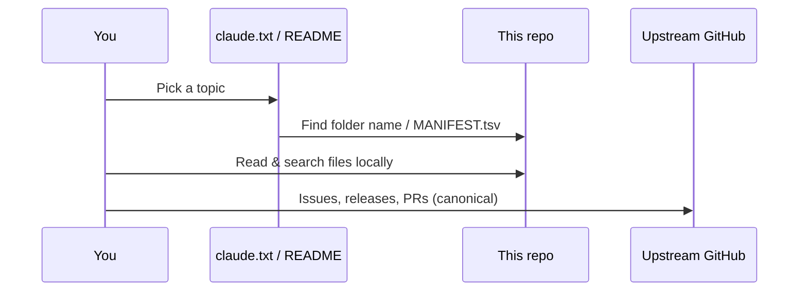
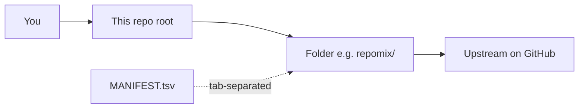

<div align="center">

# Awesome Claude Universe

**One repository. Official tooling, community lists, skills, MCP servers, editors, and workflow stacks — organized for discovery.**

[](https://github.com/Najeebullah3124/awesome-claude-universe/stargazers)
[](https://github.com/Najeebullah3124/awesome-claude-universe/network/members)
[](https://github.com/Najeebullah3124/awesome-claude-universe/commits/main)
[](https://github.com/anthropics/claude-code)
[](https://github.com/modelcontextprotocol/servers)

<br/>

```
   █████╗ ██╗    ██╗███████╗ ██████╗ ███╗   ███╗███████╗
  ██╔══██╗██║    ██║██╔════╝██╔═══██╗████╗ ████║██╔════╝
  ███████║██║ █╗ ██║█████╗  ██║   ██║██╔████╔██║███████╗
  ██╔══██║██║███╗██║██╔══╝  ██║   ██║██║╚██╔╝██║╚════██║
  ██║  ██║╚███╔███╔╝███████╗╚██████╔╝██║ ╚═╝ ██║███████║
  ╚═╝  ╚═╝ ╚══╝╚══╝ ╚══════╝ ╚═════╝ ╚═╝     ╚═╝╚══════╝
        Claude  ·  Skills  ·  MCP  ·  Agents  ·  Tools
```

[Browse on GitHub](https://github.com/Najeebullah3124/awesome-claude-universe) · [Open `MANIFEST.tsv`](MANIFEST.tsv) · [Source list `claude.txt`](claude.txt)

</div>

---

## Table of contents

- [At a glance](#at-a-glance)
- [Navigation & workflow](#navigation--workflow)
- [What is inside](#what-is-inside)
- [Spotlight](#spotlight-10-hand-picked)
- [Full directory index](#full-directory-index-78-repositories)
- [How to use this repo](#how-to-use-this-repo)
- [Sync & scripts](#sync--scripts)
- [FAQ](#faq)
- [License & attribution](#license--attribution)

---

## At a glance

| Metric | Value |
|--------|------:|
| **Bundled upstream snapshots** | **78** (see [`MANIFEST.tsv`](MANIFEST.tsv)) |
| **Layout** | **Flat** — each upstream project is a **top-level folder** (no `sources/` indirection) |
| **Origin list** | [`claude.txt`](claude.txt) — categories, descriptions, and extra “search-only” ideas |
| **Deep clones** | Snapshots are **file trees only** (nested `.git` removed so this stays one repo) |

---

## Navigation & workflow

### Quick links (start here)

| If you want to… | Open this folder |
|-----------------|------------------|
| Read the official CLI + plugins | [`claude-code/`](claude-code/) |
| Copy official examples & notebooks | [`anthropic-cookbook/`](anthropic-cookbook/) |
| Browse the big community index | [`awesome-claude-code-hesreallyhim/`](awesome-claude-code-hesreallyhim/) |
| See reference MCP servers | [`servers/`](servers/) |
| Pack a repo for LLM context | [`repomix/`](repomix/) |
| Inspect local Claude Code usage | [`ccusage/`](ccusage/) |
| Study hooks deeply | [`claude-code-hooks-mastery/`](claude-code-hooks-mastery/) |
| Compare editor integrations | [`continue/`](continue/) · [`zed/`](zed/) · [`claude-code.nvim/`](claude-code.nvim/) |

### Typical workflow



### How folders map to GitHub



---

## What is inside

This monorepo is a **single checkout** that bundles many independent projects so you can:

- **Search locally** across skills, hooks, docs, and examples in one place.
- **Compare** competing approaches (e.g. multiple `awesome-claude-code*` lists).
- **Jump to upstream** using the links in [`MANIFEST.tsv`](MANIFEST.tsv) or the table below.

**Included themes** (aligned with `claude.txt`):

| Theme | Examples (folder names) |
|--------|-------------------------|
| Official Anthropic | `claude-code`, `anthropic-cookbook`, `claude-code-action`, `anthropic-quickstarts` |
| Curated lists | `awesome-claude-code-hesreallyhim`, `awesome-claude-plugins`, `awesome-chatgpt-prompts` |
| Skills & frameworks | `superpowers`, `everything-claude-code`, `claude-scientific-skills`, `skills`, `skill-codex` |
| Orchestration | `gstack`, `ccpm`, `ralph-orchestrator`, `agentsys`, `sudocode` |
| Hooks & safety | `claude-code-hooks-mastery`, `Dippy`, `parry` |
| MCP | `servers`, `aws-mcp-server` |
| Tools & editors | `repomix`, `ccusage`, `zed`, `continue`, `aider`, `litellm`, `n8n`, `dify`, `Flowise` |
| Guides & prompts | `claude-code-tips`, `system-prompts-and-models-of-ai-tools`, `ralph-playbook` |

---

## Spotlight (10 hand-picked)

| # | Folder | Why open it |
|---|--------|-------------|
| 1 | [`claude-code`](claude-code/) | Official Claude Code CLI and plugins |
| 2 | [`anthropic-cookbook`](anthropic-cookbook/) | Official patterns and notebooks |
| 3 | [`servers`](servers/) | Reference MCP server implementations |
| 4 | [`awesome-claude-code-hesreallyhim`](awesome-claude-code-hesreallyhim/) | Large community index of Claude Code resources |
| 5 | [`everything-claude-code`](everything-claude-code/) | Broad skills + agents library |
| 6 | [`superpowers`](superpowers/) | Opinionated TDD / workflow framework |
| 7 | [`gstack`](gstack/) | Garry Tan–style multi-agent “team” setup |
| 8 | [`repomix`](repomix/) | Pack repos into AI-friendly context |
| 9 | [`ccusage`](ccusage/) | Token / usage insights from local logs |
| 10 | [`zed`](zed/) | Editor with strong Claude integration story |

---

## Full directory index (78 repositories)

<details>
<summary><strong>Click to expand the complete table</strong> (local folder → upstream GitHub)</summary>

| Local folder | Upstream |
|---|---|
| `ab-method` | [ayoubben18/ab-method](https://github.com/ayoubben18/ab-method) |
| `agent-skills` | [jawwadfirdousi/agent-skills](https://github.com/jawwadfirdousi/agent-skills) |
| `agentic-workflow-patterns` | [ThibautMelen/agentic-workflow-patterns](https://github.com/ThibautMelen/agentic-workflow-patterns) |
| `agentsys` | [avifenesh/agentsys](https://github.com/avifenesh/agentsys) |
| `aider` | [paul-gauthier/aider](https://github.com/paul-gauthier/aider) |
| `anthropic-cookbook` | [anthropics/anthropic-cookbook](https://github.com/anthropics/anthropic-cookbook) |
| `anthropic-quickstarts` | [anthropics/anthropic-quickstarts](https://github.com/anthropics/anthropic-quickstarts) |
| `awesome-chatgpt-prompts` | [f/awesome-chatgpt-prompts](https://github.com/f/awesome-chatgpt-prompts) |
| `awesome-claude-code-hesreallyhim` | [hesreallyhim/awesome-claude-code](https://github.com/hesreallyhim/awesome-claude-code) |
| `awesome-claude-code-jqueryscript` | [jqueryscript/awesome-claude-code](https://github.com/jqueryscript/awesome-claude-code) |
| `awesome-claude-code-plugins` | [ccplugins/awesome-claude-code-plugins](https://github.com/ccplugins/awesome-claude-code-plugins) |
| `awesome-claude-code-toolkit` | [rohitg00/awesome-claude-code-toolkit](https://github.com/rohitg00/awesome-claude-code-toolkit) |
| `awesome-claude-plugins` | [quemsah/awesome-claude-plugins](https://github.com/quemsah/awesome-claude-plugins) |
| `aws-mcp-server` | [alexei-led/aws-mcp-server](https://github.com/alexei-led/aws-mcp-server) |
| `ay-skills` | [ayautomate/ay-skills](https://github.com/ayautomate/ay-skills) |
| `cc-devops-skills` | [akin-ozer/cc-devops-skills](https://github.com/akin-ozer/cc-devops-skills) |
| `ccpm` | [automazeio/ccpm](https://github.com/automazeio/ccpm) |
| `ccusage` | [ryoppippi/ccusage](https://github.com/ryoppippi/ccusage) |
| `claude-code` | [anthropics/claude-code](https://github.com/anthropics/claude-code) |
| `claude-code-action` | [anthropics/claude-code-action](https://github.com/anthropics/claude-code-action) |
| `claude-code-agents` | [undeadlist/claude-code-agents](https://github.com/undeadlist/claude-code-agents) |
| `claude-code-base-action` | [anthropics/claude-code-base-action](https://github.com/anthropics/claude-code-base-action) |
| `claude-code-docs` | [ericbuess/claude-code-docs](https://github.com/ericbuess/claude-code-docs) |
| `Claude-Code-Everything-You-Need-to-Know` | [wesammustafa/Claude-Code-Everything-You-Need-to-Know](https://github.com/wesammustafa/Claude-Code-Everything-You-Need-to-Know) |
| `claude-code-hooks-mastery` | [disler/claude-code-hooks-mastery](https://github.com/disler/claude-code-hooks-mastery) |
| `claude-code-infrastructure-showcase` | [diet103/claude-code-infrastructure-showcase](https://github.com/diet103/claude-code-infrastructure-showcase) |
| `Claude-Code-Repos-Index` | [danielrosehill/Claude-Code-Repos-Index](https://github.com/danielrosehill/Claude-Code-Repos-Index) |
| `claude-code-rules` | [nikiforovall/claude-code-rules](https://github.com/nikiforovall/claude-code-rules) |
| `claude-code-showcase` | [ChrisWiles/claude-code-showcase](https://github.com/ChrisWiles/claude-code-showcase) |
| `claude-code-system-prompts` | [Piebald-AI/claude-code-system-prompts](https://github.com/Piebald-AI/claude-code-system-prompts) |
| `claude-code-tips` | [ykdojo/claude-code-tips](https://github.com/ykdojo/claude-code-tips) |
| `claude-code-tools` | [Prasad-Chalasani/claude-code-tools](https://github.com/Prasad-Chalasani/claude-code-tools) |
| `claude-code.el` | [stevemolitor/claude-code.el](https://github.com/stevemolitor/claude-code.el) |
| `claude-code.nvim` | [greggh/claude-code.nvim](https://github.com/greggh/claude-code.nvim) |
| `claude-codex-settings` | [fcakyon/claude-codex-settings](https://github.com/fcakyon/claude-codex-settings) |
| `claude-esp` | [phiat/claude-esp](https://github.com/phiat/claude-esp) |
| `claude-hub` | [claude-did-this/claude-hub](https://github.com/claude-did-this/claude-hub) |
| `claude-mountaineering-skills` | [dreamiurg/claude-mountaineering-skills](https://github.com/dreamiurg/claude-mountaineering-skills) |
| `claude-scientific-skills` | [K-Dense-AI/claude-scientific-skills](https://github.com/K-Dense-AI/claude-scientific-skills) |
| `claude-session-restore` | [ZENG3LD/claude-session-restore](https://github.com/ZENG3LD/claude-session-restore) |
| `claude-skills-jeffallan` | [jeffallan/claude-skills](https://github.com/jeffallan/claude-skills) |
| `claude-skills-robertguss` | [robertguss/claude-skills](https://github.com/robertguss/claude-skills) |
| `claude-tmux` | [nielsgroen/claude-tmux](https://github.com/nielsgroen/claude-tmux) |
| `claude-toolbox` | [serpro69/claude-toolbox](https://github.com/serpro69/claude-toolbox) |
| `claudekit` | [Carl-Rannaberg/claudekit](https://github.com/Carl-Rannaberg/claudekit) |
| `cloudartisan.github.io` | [cloudartisan/cloudartisan.github.io](https://github.com/cloudartisan/cloudartisan.github.io) |
| `compound-engineering-plugin` | [EveryInc/compound-engineering-plugin](https://github.com/EveryInc/compound-engineering-plugin) |
| `container-use` | [dagger/container-use](https://github.com/dagger/container-use) |
| `context-engineering-kit` | [NeoLabHQ/context-engineering-kit](https://github.com/NeoLabHQ/context-engineering-kit) |
| `ContextKit` | [Cihat-Gunduz/ContextKit](https://github.com/Cihat-Gunduz/ContextKit) |
| `continue` | [continuedev/continue](https://github.com/continuedev/continue) |
| `dagger` | [dagger/dagger](https://github.com/dagger/dagger) |
| `dify` | [langgenius/dify](https://github.com/langgenius/dify) |
| `Dippy` | [ldayton/Dippy](https://github.com/ldayton/Dippy) |
| `everything-claude-code` | [affaan-m/everything-claude-code](https://github.com/affaan-m/everything-claude-code) |
| `Flowise` | [FlowiseAI/Flowise](https://github.com/FlowiseAI/Flowise) |
| `gstack` | [garrytan/gstack](https://github.com/garrytan/gstack) |
| `litellm` | [BerriAI/litellm](https://github.com/BerriAI/litellm) |
| `mcp-framework` | [mcpframework/mcp-framework](https://github.com/mcpframework/mcp-framework) |
| `model-context-protocol` | [anthropics/model-context-protocol](https://github.com/anthropics/model-context-protocol) |
| `n8n` | [n8n-io/n8n](https://github.com/n8n-io/n8n) |
| `obsidian-skills` | [kepano/obsidian-skills](https://github.com/kepano/obsidian-skills) |
| `omnara` | [Ishaan-Sehgal/omnara](https://github.com/Ishaan-Sehgal/omnara) |
| `parry` | [vaporif/parry](https://github.com/vaporif/parry) |
| `ralph-for-claude-code` | [frank-bria/ralph-for-claude-code](https://github.com/frank-bria/ralph-for-claude-code) |
| `ralph-orchestrator` | [mikeyobrien/ralph-orchestrator](https://github.com/mikeyobrien/ralph-orchestrator) |
| `ralph-playbook` | [claytonfarr/ralph-playbook](https://github.com/claytonfarr/ralph-playbook) |
| `ralph-wiggum-bdd` | [marcindulak/ralph-wiggum-bdd](https://github.com/marcindulak/ralph-wiggum-bdd) |
| `repomix` | [yamadashy/repomix](https://github.com/yamadashy/repomix) |
| `servers` | [modelcontextprotocol/servers](https://github.com/modelcontextprotocol/servers) |
| `skill-codex` | [skills-directory/skill-codex](https://github.com/skills-directory/skill-codex) |
| `skills` | [trailofbits/skills](https://github.com/trailofbits/skills) |
| `sudocode` | [sudocode-ai/sudocode](https://github.com/sudocode-ai/sudocode) |
| `superpowers` | [obra/superpowers](https://github.com/obra/superpowers) |
| `system-prompts-and-models-of-ai-tools` | [x1xhlol/system-prompts-and-models-of-ai-tools](https://github.com/x1xhlol/system-prompts-and-models-of-ai-tools) |
| `taches-cc-resources` | [glittercowboy/taches-cc-resources](https://github.com/glittercowboy/taches-cc-resources) |
| `web-asset-generator` | [alonw0/web-asset-generator](https://github.com/alonw0/web-asset-generator) |
| `zed` | [zed-industries/zed](https://github.com/zed-industries/zed) |

</details>

---

## How to use this repo

1. **Clone** this repository (be aware of size — it bundles many projects).
2. **Open any folder** at the repository root; treat it like a normal project checkout (without its own `.git` history).
3. **Prefer upstream** for issues, PRs, and releases: use the link in [`MANIFEST.tsv`](MANIFEST.tsv) for the canonical project.
4. **Search globally** in your editor across folders to compare patterns (hooks, skills, MCP configs).

Example:

```bash
git clone https://github.com/Najeebullah3124/awesome-claude-universe.git
cd awesome-claude-universe
ls   # each directory is one upstream snapshot
```

---

## Sync & scripts

| Script | Purpose |
|--------|---------|
| [`scripts/sync_from_claude_txt.py`](scripts/sync_from_claude_txt.py) | Parse [`claude.txt`](claude.txt) and emit `MANIFEST.tsv` (folder + URL + owner) |
| [`scripts/clone_manifest.sh`](scripts/clone_manifest.sh) | Shallow-clone each manifest entry into the matching folder (skips non-empty dirs) |

Regenerate the manifest after editing `claude.txt`:

```bash
python3 scripts/sync_from_claude_txt.py claude.txt > MANIFEST.tsv
```

---

## FAQ

**Why are some `MANIFEST.tsv` rows missing as folders?**  
A few upstream URLs moved, were renamed, or returned 404 when cloned. The manifest still lists the *intended* target so you can fix the URL and run [`scripts/clone_manifest.sh`](scripts/clone_manifest.sh) again.

**Why does `claude.txt` mention more than 78 repos?**  
Many lines link to **GitHub search**, not a single repository. Only real `github.com/owner/repo` URLs are in the manifest.

**Is this a fork of every project?**  
No. It is a **snapshot index**: one checkout, no nested `.git` per project. Use each project’s own repo for history and collaboration.

**Will this repo stay tiny?**  
No. It is intentionally large. Clone with intent, or clone then delete folders you do not need.

**Where did `gstack` come from if `claude.txt` says `gtanczyk/gstack`?**  
That path was not available as a normal public clone; the bundle uses **[`garrytan/gstack`](https://github.com/garrytan/gstack)** as the canonical Garry Tan setup.

---

## License & attribution

- **This collection** does not replace upstream licenses. Each subdirectory remains the work of its authors; **retain their `LICENSE` files and copyright notices** if you redistribute or fork.
- **Not affiliated** with Anthropic, GitHub, or the owners of bundled repositories — this is an **independent mirror index** for learning and discovery.
- Some files were **sanitized** (placeholder secrets) so the repository can pass **GitHub push protection**; diff against upstream if you need original fixtures.

---

## Star history

[](https://star-history.com/#Najeebullah3124/awesome-claude-universe&Date)

---

<div align="center">

**If this saved you time, consider starring the repo and sharing the upstream projects you actually use.**

Made with care for the Claude Code community.

</div>
